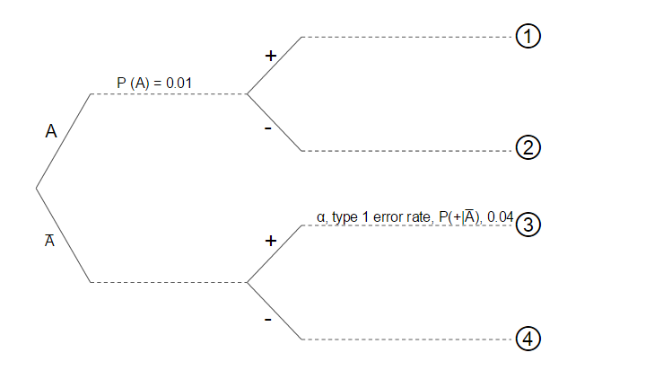

Suppose that 1% of the population has a particular medical condition.

Let us describe the state of having the condition as "$A$".

Thus $P(A) = 0.01$    -   which means "the probability of being in state $A$ is 0.01"

Since you either have the medical condition or you do not, the two probabilities, that of having the condition $P(A)$, and that of not having it, $P\bar{A}$), must add up to one.

Hence $P(\bar{A}) = 1 - P(A) = 1 - 0.01 = 0.99$

where $\bar{A}$ means "$\mathrm{not}\ A$".  

***  

__Q1__ What is the prevalence of this medical condition? __________________________  

***

This prevalence is our prior knowledge of the "state" of a person. It is the probability that someone has the disease, prior to any test being carried out. Later, we will see that we need to know this,  as well as details of the test, in order to calculate the posterior - the conditional probability $P(+|A)$ that an individual has the disease given that a test has been carried out and yielded a positive result.

Now suppose we have a test for the presence of $A$. The outcome of this test is either positive $(+)$ or negative $(-)$.

If a person has the condition, the chance that our test will correctly detect it and give a positive $(+)$ result  is 0.8.

If a person does not have the condition, the chance that our test will correctly detect that and give a negative result $(-)$ is 0.96.  

***  

__Q2__  What is the _sensitivity_ of this test ? _________________________________  

***

__Q3__ What is the _specificity_ of this test ? _________________________________  
  
***

Now let us introduce the idea of conditional probabilities - the probability that  one outcome is true given that another oucome is true. We write this as:

$P(\mathrm{state\ } 1 | \mathrm{state\ } 2)$  -- which means "the probability that state 1 is true _given_ that state 2 is true"

__Q4__ What is meant by the expression $P(+|A)$ ? Is it:

1. The probability that a person has the condition (regardless of the outcome of any test)
2. The probability of getting a positive test result given that the person actually has the condition
3. The probability of getting a positive test result (regardless of whether the person actually has the condition)
4. The probability that a person has the condition, given that the outcome of a test was positive

***

__Q5__ In our example, what are the values of :

* $P(+|A)$  
* $P(+|\bar{A})$  
* $P(-|A)$  
* $P(-|\bar{A})$ 

***

__Q6__ Use arrows to match the expressions in Q5 to the terms in the list on the right, and fill in the corresponding values:  

Expression   | Term | Value
--|--|--
$P(+|A)$ | specificity |
|||
$P(+|\bar{A})$ | sensitivity |
$P(-|A)$ | power |
$P(-|\bar{A})$ | Type I error rate $\alpha$ |
   || Type II error rate $\beta$ |

***

__Q7__ What is the power of the test  in terms of the Type II error rate $\beta$?

***

__Q8__ Complete the tree diagram below with all of the terms and numbers used so far.

 

***

In the example shown, think of $P(+|\bar{A})$)  as the probability that someone follows the $+$ branch, given that they have already followed the $\bar{A}$ branch.

__Q8__ If a random person walks into a clinic they may or may not have the condition A, and if they are tested, the outcome may or may not be positive. So there  are four possible outcomes, corresponding to the four branches of the tree diagram:

Assign each of these outcomes to the correct number row on the right in the diagram above

Outcome | Final branch of tree diagram
--|--
A person is healthy AND tests positive ||
A person is healthy AND tests negative ||
A person is ill AND tests positive ||
A person is ill AND tests negative ||

***

__Q9__ In hypothesis testing, in the frequentist approach, all we have after a test is the outcome of the test itself, and any knowledge we have as to the efficacy of the test. Suppose after testing an individual we get a positive result. and we claim that we have a _p_-value that is below our chosen significance threshold of 0.05, so that we have, we claim, a "statistically significant" result.

Remember that _p_ values tell us the probability that we would have got a particular experimental result given that the null hypothesis is true.

__Q10__ What would be an appropriate null hypothesis in this case?

__Q11__ This _p_-value, as usually defined, would tell us which of these probabilities:

* The probability that the person had the condition, given the positive result
* The probability that they were healthy, given the positive result
* The probability that we would have got this positive result, if they were healthy
* The probability that we would have got this positive result if they had the condition

__Q12__ Given the numbers above, what is the p-value for a positive test result, given that the person has the disease?
  

__Q13__ Of the options listed in Q11, which is the result that is really of interest?
  
  
Let us try to calculate this result. To do this, we will calculate the probabilities of each of the four possible outcomes:

__Q14__ Calculate the probabilites of each of the outcomes 1 to 4, given a randomly selected individual who has not yet been tested.  
In doing this you will be using the result: 
  
$\mathrm{Probability\ of\ A\ AND\ B} = P (A \cap B) = P(A|B) \times P(B) = P(B|A) \times P(A)$  
  
For, example, the probability of outcome 1 is the probability that someone has the condition AND that they have tested positive: This probability is the product of the probabilities of the two successive choices that were made in the journey along the tree from left to right. 

$P(1) = P(A \cap +) = P(A) × P(+|A) = 0.01 ×\times 0.8 = 0.008$ 
  
$P(2) =$ 
  
$P(3) =$  
  
$P(4) =$  
  
__Q15__ Check that $P(1) + P(2) + P(3) + P(4) = 1$.  
Why must this be the case?

__Q16__ What is the probability $P(+)$ of getting a positive result, regardless of whether the person is healthy or has the condition?
(Hint: this is the sum of two of the outcomes you calculate in Q14.)

__Q17__ From the numbers you have already calculated, find the probability $P(A|+)$ that someone who has tested positive does have the condition. This is the same as asking "what proportion of those who test positive actually have the condition?"
(Hint: you can find this using the two values that you used in Q16)

__Q18__ This probability, $P(A|+)$ is a __Bayesian__ result. It can be expressed in the form:

$$P(A|+)=\dfrac{P(+|A)\cdot P(A)}{P(+)}$$

We know all the terms on the right hand side of this equation. Use these values to calculate $P(A|+)$ and check that it agrees with your result from Q17

This true positive (TP) result is arguably a more interesting result than the p-value in that it tells us about the probability of our hypothesis (A, that the person has the condition) given an experimental result (+, that the test had a positive outcome), rather than about the probability of a set of data, given a hypothesis.  

This result $P(+|A)$ is called a _posterior_ result, in that it is what we _now_ know about the probability of someone having the disease, _given_ that a test has been carried out and had a positive result. 

However, notice that the term $P(A)$ appears in the expression.This is _prior_ knowledge that has not emerged from doing the test. We had to know this already. It is called the prior term in that it represents what we could say about the likelihood of someone having the condition _before_ we had tested them.

One could argue that this inclusion of prior knowledge is both a strength and a weakness of the Bayesian approach. Here, we might be very confident that we know $P(A)$, the prevalence of the condition,  from a host of independent studies that might have been carried out.

More generally, however, $P(A)$ might be taken to represent the likelihood we assign to the probability that some prior condition is true. Two researchers might disagree about this. They might use their knowledge of the field, of mechanisms, of the number of supporting results and so on. However the value of $P(A)$ might be a judgement, or at least involve some element of subjective judgement, and that is why many, those in the frequentist camp, might object to the Bayesian approach.

__Q17__ Are you surprised at the low value of $P(A|+)$? We had a test with high power (0.8) and yet, despite a positive result, it emerges that the person is still much more likely not to have the disease than to have it. More generally, you can think of this as being an example of where we have done an experiment, with high power, detected an effect, and yet it is much more likely than not, despite this, that there is in fact no real effect.

Why is this?  
  
At least in part it is because in this case the _prior_ term $P(A)$ is so low.

Let us see how much higher the likelihood of their being a real effect is, given a positive result from the same test, if the prevalence is much higher:

Calculate P(A|+) if the prevalence of the condition is in fact, or least is thought to be, 0.7, given the same power and specificity (0.8 and 0.96 of the test)

***

A way to think about this is in terms of hypotheses. Suppose we have a hypothesis A, and a test for that hypothesis that can have two outcomes: + (A is verified, and we reject the null hypothesis $\bar{A}$) or - (A is not verified and we do not reject the null hypothesis). In that case, $P(A)$, what we have called the prior, represents our assessment of how likely it is that A is correct, before we carry out our test, and P(A|+), what we have called the posterior, represents our new assessment of the likelihood that A is correct, having done the test and got a positive result. The Bayesian expression shows us that the less likely we think it is that our hypothesis is true (eg prevalence of disease is very low) before we do our test, then the less likely it is that a positive result of the test indicates a real effect. In contrast, if we think it highly likely that our hypothesis _is_ true before we do the test (eg prevalence of disase is high) then it is more likely that a positive test result _has_ revealed a real effect.

### The Bayes Factor

####Odds
We can explore this idea futher using the concept of _odds_, a term commonly used in betting.

Suppose a trial has two possible outcomes $A$ and $\bar{A}$. The trial could be, for example, tossing a coin, or rolling a die, or finding out if someone has a disease, and the outcomes in these cases would be heads or tails for the coin toss, a six or anything but a six, for example, for the die roll, or yes they do have the disease, or no they don't.

In each case, if one of the possible outcomes has probability $p$, then the other outcome must have probability $1-p$, since the two probabilities must add up to one.

The odds of getting one outcome rather than the other is the ratio of the probabilities of getting each:

$$\mathrm{Odds\ }=\dfrac{P(1)}{P(2)}=\dfrac{p}{1-p}$$

This is a measure of how much more or less likely outcome 1 is than outcome 2. Thus if there were a 0.25 chance of getting outcome 1, there would be a 0.75 chance of getting outcome 2, and the odds would be 1 to 3 : outcome 1 is three times less likely than outcome 2. For the toss of a fair coin, where each of the possible outcomes has probability 0.5, the odds would be 1: each outcome is likely as the other.

It would be nice to know, after an experiment in which we get a positive result, whether it is more likely than not that there is a real effect, or more likely than not that there isn't one. Or, put another way, to have an idea as to how to design our investigation such that afterwards, if we get a positive result, and we think we have detected an effect, we can say that it is more likely than not that that effect is real, and could be reproduced by another investigator.

Consider equation (1), our Bayesian expression for the probability $P(A|+)$ that there is a real effect, given a positive outcome of our measurement. The equivalent expression for the false positive rate (FP), which is the probability $P(\bar{A}|+)$ that we get a positive outcome of our test despite that nothing is going on (the person is healthy), is

$$P(\bar{A}|+)=\dfrac{P(+|\bar{A})\cdot P(\bar{A})}{P(+)}$$

If we now divide equation (1) by equation (3), the $P(+)$ terms cancel and we are left with:

$$\dfrac{P(A|+)}{P(\bar{A}|+)}=\dfrac{P(+|A)}{P(+|\bar{A})}\cdot \dfrac{P(A)}{P(\bar{A})}$$

On the left we have a ratio of the probability of a correct positive result to that of an incorrect positive result. Since, given a positive result, it must either be correct or incorrect, this is an odds ratio, where the two conditional probabilities must add up to one. Moreover, this is the _posterior odds_, which is a measure, _following the experiment, given a positive result_, of how much more likely it is that the result is correct than incorrect. We could also think of this as a measure, following a positive result, of how much more likely we think it is that the alternate hypothesis $A$ is correct than the null hypothesis $\bar{A}$.

On the right hand side we have two terms, one of them $\dfrac{P(A)}{P(\bar{A})}$ is also an odds ratio. We call it the _prior odds_ since it a ratio of the probabilities we can assign to the alternate hypothesis $A$ (eg the person is ill, there is an effect) and the the null hypothesis (there is nothing going on, the person is fine, there is no effect), _before we have done the experiment_.

Thus the other term on the right:

$$\dfrac{P(+|A)}{P(+|\bar{A})}$$

can be thought of as the factor by which our confidence in the truth of the alternate hypothesis has been enhanced by our doing the experiment, if we get a positive result. This is sometimes called the __Bayes factor__ or likelihood ratio. We would like this to be as high as possible, and certianly to greater than one, or what is the point of doing the experiment? If we unpick it, we that the term on the top $P(+|A)$ is the sensitivity, or power of our experiment - the likelihood that, if there is an effect, we will detect it. We could call it the True Positive Rate (TPR). The term on the bottom, $P(+|\bar{A})$, is the False Positive Rate (FPR), which is one minus the specificity. hence we can write:

$$
\begin{align}
\mathrm{Posterior\ odds} &= \mathrm{Bayes\ Factor}\times\mathrm{Prior\ odds}\\
&=\left(\dfrac{\mathrm{power}}{\mathrm{1-specificity}}\right)\times\mathrm{Prior\ odds}
\end{align}
$$

Not surprisingly, perhaps, this tells us that for our confidence in the truth of a hypothesis to be enhnanced by an experiment, this is best done by designing the experiment such that it has both high power and high specificity.

### We detect an effect. Is our result more likely right than wrong?
In terms of the framework that we have developed here, this question is the same as asking whether our posterior odds are at least equal to one. Have we got even odds or better? By design and by independent measurement we might be able to quantify the Bayes factor. It might be less easy to quantify the prior odds, but let us consider the difference between cases where the prior odds were in fact very low, and those where they were high.

For example, suppose, as we have here, that our alternate hypothesis is that someone has a disease, and our experiment is to carry out a test for that disease. Following a positive test result, is it more likely than not that the person actually has the disease? Or, put another way, is it more likely than not that the result is correct? Consider a case where the disease is very rare. Suppose 1 person in 1000 has this disease, so that 999 do not. In that case, our prior odds are 1 in 999, so for posterior odds that are at least evens, we need a Bayes factor of 999. If we had designed our experiment to have a power of 0.8, then this means, if you do the maths, that a specificity of 0.999 is required. Hence, an experimental procedure is required that has a false positive rate of only one part in a thousand. 

In reality, the false positive rate for a real test would likely be greater than that, so that the posterior odds for a rare condition, while greater than the prior odds, could still be much less than one, despite a positive result. 

If this seems counter intutive, consider the case of breast cancer among women in their forties, and the question of whether to routinely screen for this using mammograms. The prevalence of this condition among this group is about 1.4 %, so that the prior odds for beast cancer among this group would be $\frac{0.014}{0.986}=0.014$. The specificty of a mammogram is about 0.9 - that is, if a woman does not have breast cancer, then a mammogram will incorrectly claim that she does about 10% of the time. On the other had, if she does have breast cancer, a mammogram will correctly show this about 75% of the time, so that the sensitivity or power of the test is 0.75. Thus the Bayes Factor in this case is $\frac{0.75}{0.1}=7.5$. The posterior odds, therefore, given a postive test result are $7.5\times0.014=0.10$ - about 10%. [@Silver2013]

If one other hand, the disease is much more prevalent, with a prior odds of 0.5, say, then the Bayes Factor only needs to be equal to 2 or more for evens or better posterior odds, so that, if the power of our test is again 0.8, we could achieve this despite a much higher false positive rate of 0.4. 

### Are most published research results wrong?
This is the startling claim made by medical researcher John Ioannidis in his 2005 paper "Why Most Published Research Findings are False" [@Ioannidis2005]. The analysis by which he arrives at this claim follows, broadly the steps taken above, and thus his calim is in fact that the posterior odds of most published results are less than one. This is the result, he suggests, of researchers operating in fields where the prior odds are low, and often, in addition, because experiments are corried out even though they have low power.

His result has been contested, for example by Jeff Leek 

### Extraordinary Claims Require Extraordinary Evidence

This is an oft repeated phrase, but we can understand it in terms of the framework we have developed here. Suppose I do an experiment and claim, on the basis of my results, to have found evidence for astrology, homeopathy, extra sensory perception or such-like. The scientific community could reasonably ask, given my result, how much more likely is it that my claim is correct than that it is wrong. Or, alternatively, if these posterior odds are to be evens or better, how great the Bayes Factor of my experiment would need to be. Now the answer to that, we have seen, is that it should be the inverse of my prior odds. If these are tiny, then my Bayes factor needs to be huge.  A few back of the envelope calculations suffices to show that, if Newtonian mechanics is correct, the claims of astrology are, indeed, extraordinary. A vast web of interconnected ideas for which there is overwhelming evidence would have to be wrong if the astrological claims were to be right. Thus the prior odds are tiny, and so the Bayes Factor of my test needs to be huge if my result, claiming to have detected a real astrological effect, is to be at all credible. My extraordinary claim would require extraordinary evidence for there to be an evens chance of it being correct. 

### References
