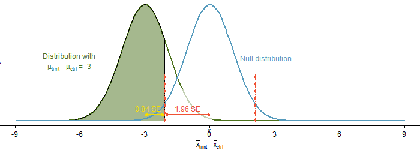
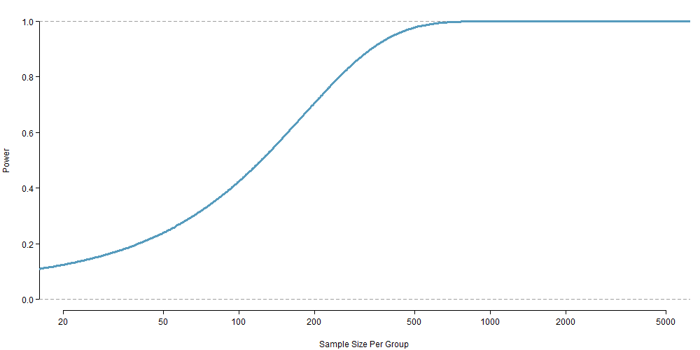
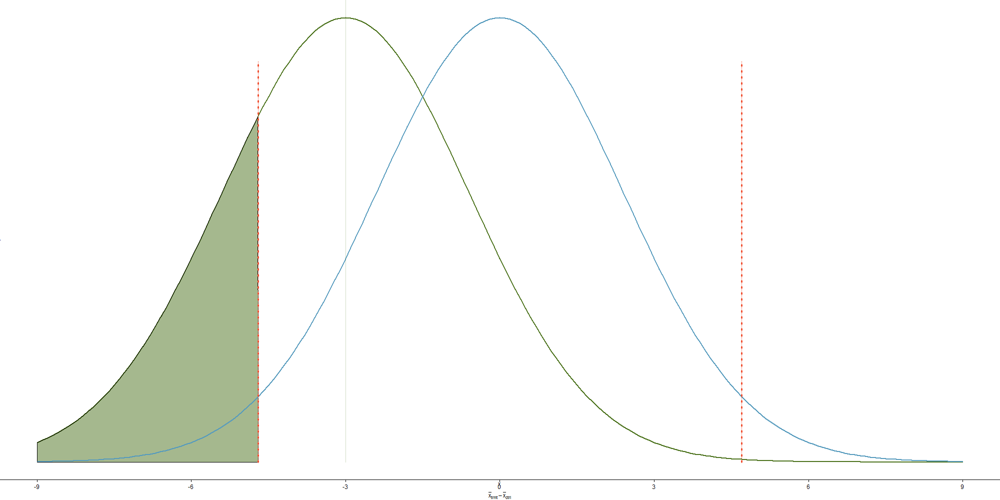
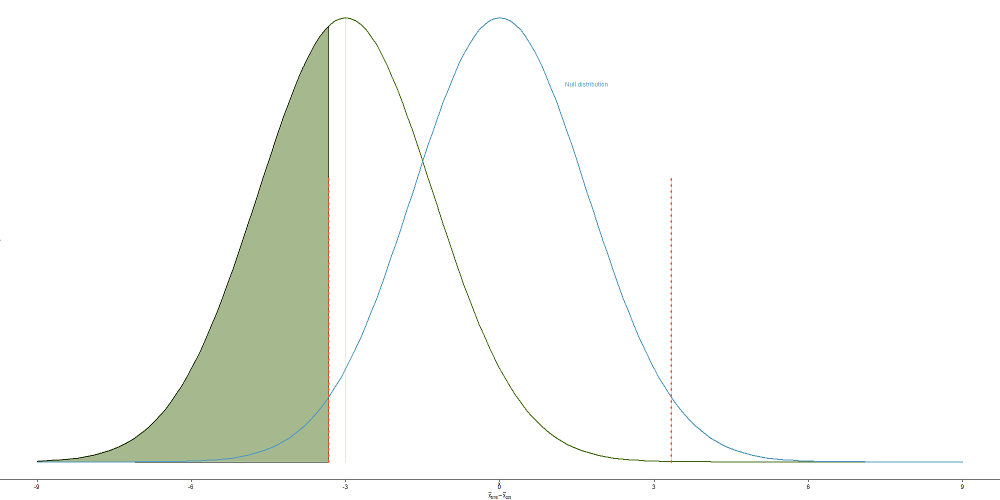
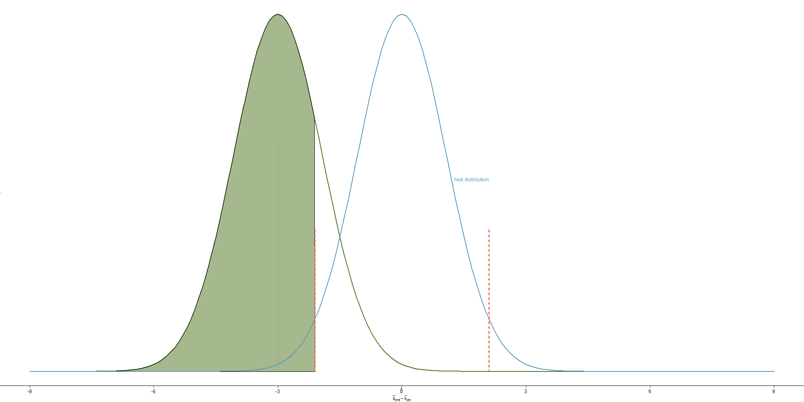
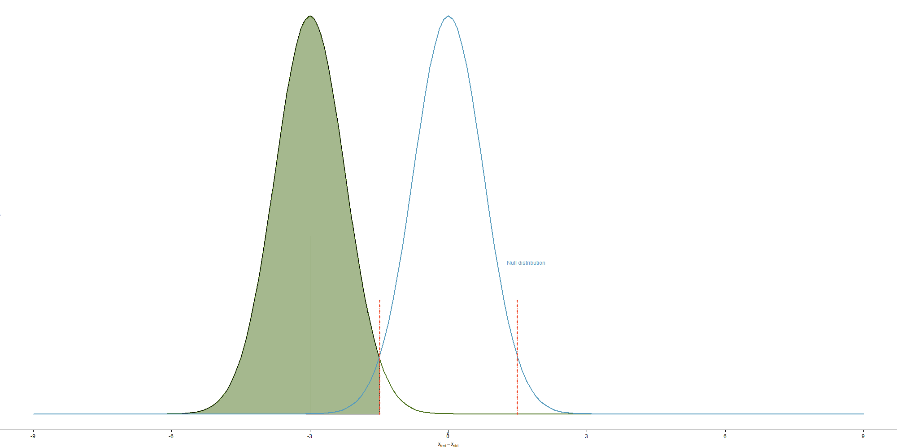
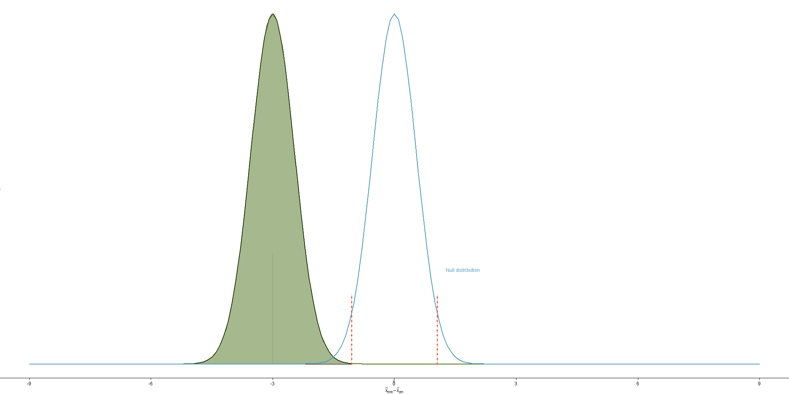
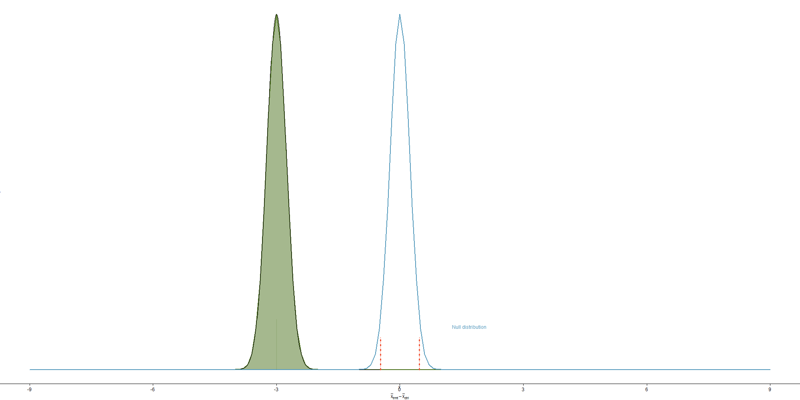

Power
========================================================
Based on 

Diez, D. M., Barr, C. D., & Cetinkaya-Rundel, M. (2015).  
_OpenIntro Statistics_ (3rd ed.).  
Open Intro.  
www.openintro.org.  

Section 5.4,  pp 239 - 245

========================================================
What chance is there that an experiment will detect a real effect?

========================================================
We want to collect enough data that we can detect important effects. 

Collecting data can be expensive, and in experiments involving people, there may be some risk or inconvenience to the subjects.

Let us consider a clinical trial, which is a health-related experiment where the subject are people, and we will determine an appropriate sample size where we can be 80% sure that we would detect any practically important effects.

Setting up a hypothesis
========================================================

Suppose a pharmaceutical company has developed a new drug for
lowering blood pressure, and they are preparing a clinical trial (experiment) to test the drug's effectiveness. 

They recruit people who are taking a particular standard blood pressure medication. People in the control group will continue to take their current medication through generic-looking pills to ensure blinding.

Write down the
hypotheses for a two-sided hypothesis test in this context.

Hypotheses
========================================================


$H_0$: The new drug performs exactly as well as the standard medication.
  $$\mu_{trmt} - \mu_{ctrl} = 0$$.
  
$H_A$: The new drug's performance differs from the standard medication.
  $$\mu_{trmt} - \mu_{ctrl} \neq 0$$.


Standard Error
========================================================
The researchers would like to run the clinical trial on patients with systolic blood pressures between 140 and 180 mmHg. 

Suppose previously published studies suggest that the standard deviation of the patients' blood pressures will be about 12 mmHg and the distribution of patient blood pressures will be approximately symmetric.

If we had 100 patients per group, what would be the approximate standard error for $\bar{x}_{trmt} - \bar{x}_{ctrl}$?

The standard error is calculated as follows:

$$\begin{align*}
SE_{\bar{x}_{trmt} - \bar{x}_{ctrl}}
  = \sqrt{\frac{s_{trmt}^2}{n_{trmt}} + \frac{s_{ctrl}^2}{n_{ctrl}}}
  = \sqrt{\frac{12^2}{100} + \frac{12^2}{100}}
  = 1.70
\end{align*}
$$

Null Distribution
========================================================
What does the null distribution of $\bar{x}_{trmt} - \bar{x}_{ctrl}$ look like?

The degrees of freedom are greater than 30, so the distribution of $\bar{x}_{trmt} - \bar{x}_{ctrl}$ will be approximately normal.

The standard deviation of this distribution (the standard error) would be about 1.70, and under the null hypothesis, its mean would be 0.


Rejecting the Null hypothesis
========================================================
For what values of $\bar{x}_{trmt} - \bar{x}_{ctrl}$ would we reject the null hypothesis?

If the observed difference is in the far left tail or far right tail of the null distribution, we reject the null hypothesis.

For $\alpha = 0.05$, we would reject $H_0$ if the difference is in the lower 2.5% or upper 2.5% tail:


__Lower 2.5%:__ For the normal model, this is 1.96 standard errors below 0, so any difference smaller than $-1.96 \times 1.70 = -3.332$ mmHg.

__Upper 2.5%:__ For the normal model, this is 1.96 standard errors above 0, so any difference larger than $1.96 \times 1.70 = 3.332$ mmHg.

========================================================
The boundaries of these _rejection regions_ are shown below:


Next, we'll perform some hypothetical calculations to determine the probability we reject the null hypothesis, if the alternative hypothesis were actually true.

Power for a 2-sample test
========================================================

When planning a study, we want to know how likely we are to detect an effect we care about.

In other words, if there is a real effect, and that effect is large enough that it has practical value,
then what's the probability that we detect that effect? 

This probability is called the __power__.

We can compute it for different _sample_ sizes or for different _effect sizes_.

What is a practically significant result?
========================================================
Suppose that the company researchers care about finding any effect on blood pressure that is 3 mmHg or larger vs the standard medication.

Here, 3 mmHg is the minimum _effect size_ of interest.

We want to know how likely we are to detect this size of an effect in the study.

Suppose we decided to move forward with 100 patients per treatment group and the new drug reduces blood pressure by an additional 3 mmHg relative to the standard medication. 

What is the probability that we detect a drop?
========================================================

Before we even do any calculations, notice that if $\bar{x}_{trmt} - \bar{x}_{ctrl} = -3$ mmHg, there wouldn't even be sufficient evidence to reject $H_0$. 


That's not a good sign!

What is the probability that we detect a drop?
========================================================

To calculate the probability that we will reject $H_0$, we need to determine a few things:

* The sampling distribution for $\bar{x}_{trmt} - \bar{x}_{ctrl}$ when the true difference is -3 mmHg. 

This is the same as the null distribution, except it is shifted to the left by 3:


What is the probability that we detect a drop?
========================================================

We also need to find:

* The sampling distribution for $\bar{x}_{trmt} - \bar{x}_{ctrl}$ when the true difference is -3 mmHg.

* The rejection regions, which are outside of the dotted lines above.
* The fraction of the distribution that falls in the rejection region.

What is the probability that we detect a drop?
========================================================

In short, we need to calculate the probability that $x < -3.332$ for a normal distribution with mean -3 and standard deviation 1.7. To do so, we first shade the area we want to calculate:


Then we calculate the Z-score and find the tail area using either the normal probability table or statistical software:

========================================================


$$Z = \frac{-3.332 - (-3)}{1.7}  = -0.20$$


```r
power<-round(pnorm(-3.332,-3,1.7),2)
power
```

```
[1] 0.42
```

The __power__ for the test is about 42% when $\mu_{trmt} - \mu_{ctrl} = -3$ and each group has a sample size of 100.

Determining a proper sample size
========================================================

If the researchers had gone ahead with a sample size of 100 they would only detect an effect size of 3 mm Hg with a probability of 0.42. 

What if they had not detected it?

That is, what if their data did not support the alternative hypothesis so that they could not reject the null hypothesis?

This would be bad because:

========================================================

* In the back of the researchers' minds, they'd all be wondering, _maybe there is a real and meaningful difference, but we weren't able to detect it with such a small sample_. 
* The company probably invested a lot of money in developing the new drug, so now they are left with great uncertainty about its potential since the experiment didn't have a great shot at detecting effects that could still be important.
* Patients were subjected to the drug, and we can't even say with much certainty that the drug doesn't help (or harm) patients.
* Another clinical trial may need to be run to get a more conclusive answer as to whether the drug does hold any practical value, and conducting a second clinical trial may take years and a lot of money.

Determining a proper sample size
========================================================
We need to avoid this situation, so we need to determine a proper sample size such that we can have high confidence that we will detect an effect of size 3 mm Hg.

Method 1: calculate power for several sample sizes
========================================================
Suppose sample size is 500.

We need to

* Determine the standard error (recall that the standard deviation for patients was expected to be about 12 mmHg).
* Identify the null distribution and rejection regions.
* Identify the alternative distribution when $\mu_{trmt} - \mu_{ctrl} = -3$.
* Compute the probability we reject the null hypothesis.

Method 1: calculate power for n=500
========================================================
$$\begin{align*}
SE_{\bar{x}_{trmt} - \bar{x}_{ctrl}}
  = \sqrt{\frac{s_{trmt}^2}{n_{trmt}} + \frac{s_{ctrl}^2}{n_{ctrl}}}
  = \sqrt{\frac{12^2}{500} + \frac{12^2}{500}}
  = 0.76
\end{align*}
$$


The rejection regions are the areas on the outside of the two dotted lines and are at 
$$\pm 0.76 \times 1.96 = \pm 1.49$$.

Effect of sample size
========================================================


Method 1: calculate power for n=500
========================================================

$$Z = \frac{-1.49 - (-3)}{0.76}  = 1.99$$


```r
power<-round(pnorm(-1.49,-3,0.76),2)
power
```

```
[1] 0.98
```

Hence, with 500 patients, the power would be 97.7% - we would be 97.7% sure that we would detect an effect of 3 mm Hg or greater.

Can you have too much power?
========================================================
Yes!

It costs money to collect data and in this case we would be unnecessarily exposing patients to a drug, which is ethically questionable. 

Common practice is to identify a sample size such that would give 80% or 90% power - the value chosen depends on the context.

The idea is to strike a balance between sufficient power and minimum exposure of patients to a drug, for example, and to avoid unnecessary expense.

What sample size will give a power of 80% ?
========================================================
We start by identifying the Z-score that would give us a lower tail of 80%: it would be about 0.84:




```r
qnorm(0.8)
```

```
[1] 0.8416212
```
What sample size will give a power of 80 ?
========================================================
Additionally, the rejection region always extends $1.96\times SE$ from the center of the null distribution for $\alpha = 0.05$. This allows us to calculate the target distance between the center of the null and alternative distributions in terms of the standard error:

$$
\begin{align*}
0.84 \times SE + 1.96 \times SE = 2.8 \times SE
\end{align*}
$$

What sample size will give a power of 80% ?
========================================================
In our example, we also want the distance between the null and alternative distributions' centers to equal the minimum effect size of interest, 3mmHg, which allows us to set up an equation between this difference and the standard error:

$$
\begin{align*}
3 &= 2.8 \times SE \\
3 &= 2.8 \times \sqrt{\frac{12^2}{n} + \frac{12^2}{n}} \\
% 3^2 &= 2.8^2 \times \left( \frac{12^2}{n} + \frac{12^2}{n} \right) \\
n &= \frac{2.8^2}{3^2} \times \left( 12^2 + 12^2 \right) = 250.88 \\
\end{align*}
$$

We should target about 251 patients per group.

========================================================
The standard error difference of $$2.8 \times SE$$ is specific to a context where the targeted power is 80% and the significance level is $\alpha = 0.05$. If the targeted power is 90% or if we use a different significance level, then we'll use something a little different.

* 80% power, 5% significance : 2.8 SEs
* 80% power, 1% significance : 3.4 SEs
* 90% power, 5% significance : 3.2 SEs
* 90% power, 1% significance : 3.9 SEs

Usually, more samples gives higher power,
Smaller effect sizes demand more samples for the same power

Can we have too many samples?
========================================================

***
<small>The power is already 100% if we have 500 samples, so there is no point in taking more samples.</small>


========================================================
transition: fade




n = 50
  


```r
power
```

```
[1] 0.24
```


========================================================
transition: fade



n = 100


```r
power
```

```
[1] 0.42
```

========================================================
transition: fade



n = 250


```r
power
```

```
[1] 0.8
```

========================================================
transition: fade



n = 500


```r
power
```

```
[1] 0.98
```

========================================================
transition: fade



n = 1000


```r
power
```

```
[1] 1
```

========================================================
transition: fade



n = 5000


```r
power
```

```
[1] 1
```
